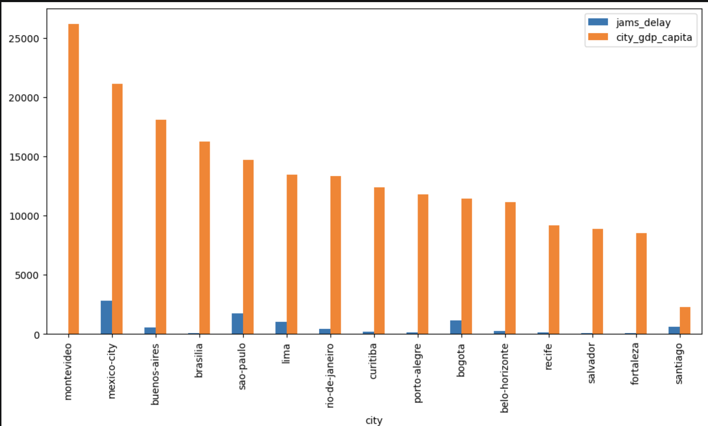
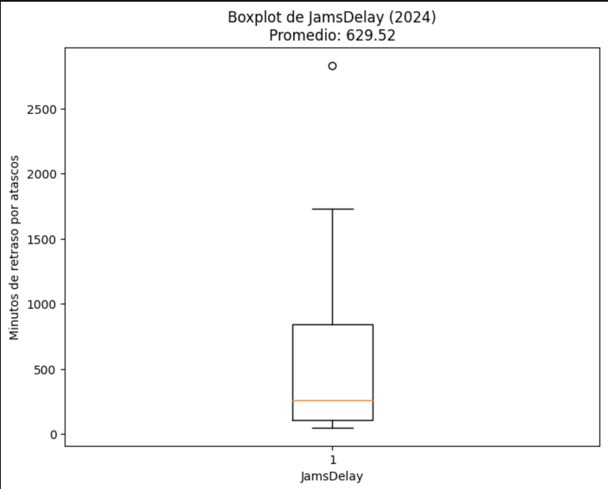
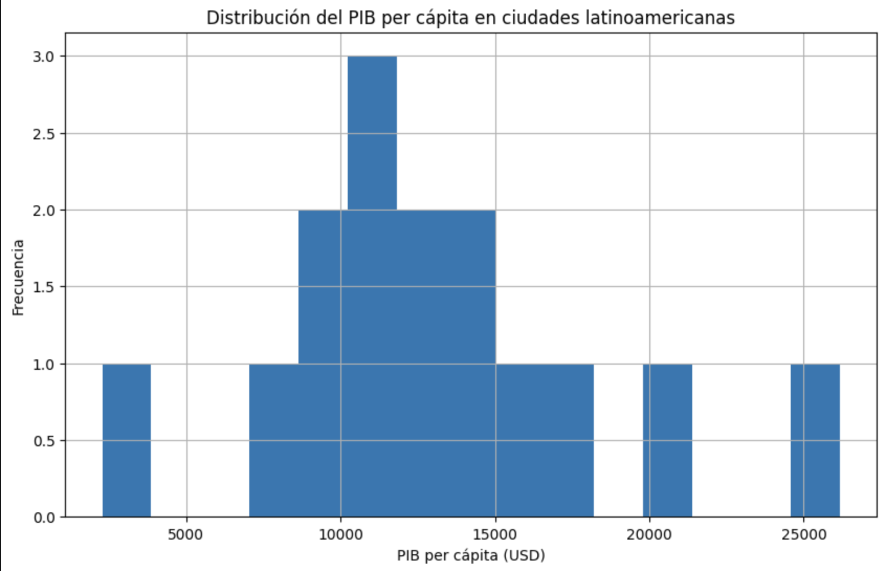

# Urban Mobility & Economic Productivity Analysis — LATAM

## The Business Problem

Latin America's major cities are growing fast — but so is their traffic. The Latin American Development Bank needed to answer a critical question before allocating infrastructure investment: *are cities losing economic productivity because of congestion, or is something else holding them back?*

I took that question and let the data answer it.

## What I Did

I combined two real-world datasets — TomTom's Traffic Index and OECD Cities economic data — to analyze the relationship between urban congestion and economic productivity across major LATAM cities. The data was messy, inconsistent, and required significant cleaning before any meaningful analysis could begin. Mixed formats, incorrect data types, and numeric symbols had to be handled before a single chart could be drawn.

Once the data was clean, I merged both datasets, aggregated traffic patterns by city, and built visualizations to surface patterns that could guide investment decisions.

## What the Data Revealed

The analysis identified cities where high congestion appears to correlate with lower economic output — pointing to mobility as a potential constraint on growth. Not every congested city tells the same story, which is exactly why the data matters: assumptions about which cities need intervention most aren't always backed by the numbers.

The findings provide a data-driven foundation for prioritizing where transportation infrastructure investments could generate the greatest economic and social impact.

## Technical Details

### Datasets

| Dataset | Source | Details |
|---|---|---|
| TomTom Traffic Index | [TomTom Traffic Index](https://www.tomtom.com/traffic-index/) | Not included (148MB — exceeds GitHub limit). Download from the official site and place in `/data/` as `tomtom_traffic.csv` |
| OECD Cities | OECD Regional Statistics | Included in `/data/oecd_city_economy.csv` |

### Analytical Workflow

| Step | Description |
|---|---|
| 1. Load & Explore | Imported datasets, reviewed structure, data types, and missing values |
| 2. Clean & Prepare | Standardised column names to snake_case, corrected data types (datetime, float), cleaned numeric formats |
| 3. Filter | Extracted 2024 data for focused analysis |
| 4. Aggregate | Calculated annual traffic averages per city using groupby |
| 5. Merge | Combined traffic and economic datasets for cross-analysis |
| 6. Analyse & Visualise | Identified patterns between congestion and economic indicators |

### Tools & Libraries
Python 3 · pandas · NumPy · Matplotlib · Seaborn

### Key Skills Demonstrated
- Data cleaning and type conversion with pandas
- Handling real-world messy data (mixed formats, symbols, separators)
- Dataset merging and aggregation
- Exploratory Data Analysis (EDA)
- Data visualisation with Matplotlib and Seaborn

### Visualisations




### Project Structure
```
urban-mobility-economy-analysis-latam/
│
├── data/
│   └── oecd_city_economy.csv
├── Urban_Mobility_LATAM_clean.ipynb
└── README.md
```

---

*By Deborah Jara | Data Analyst | México*
[LinkedIn](https://linkedin.com/in/deborahjara) · [GitHub](https://github.com/DebbieJara)
